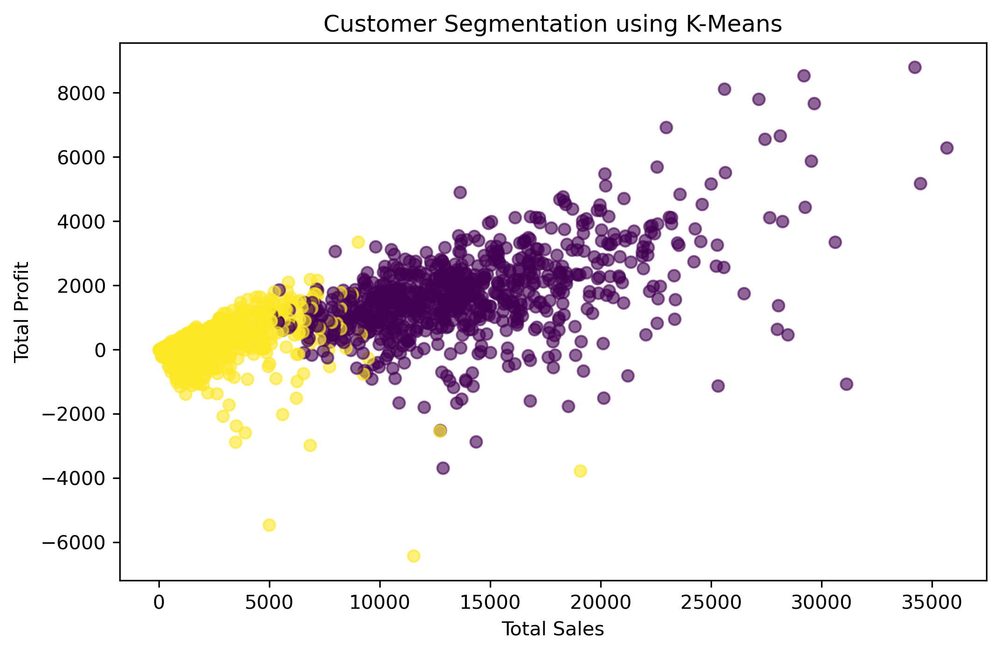
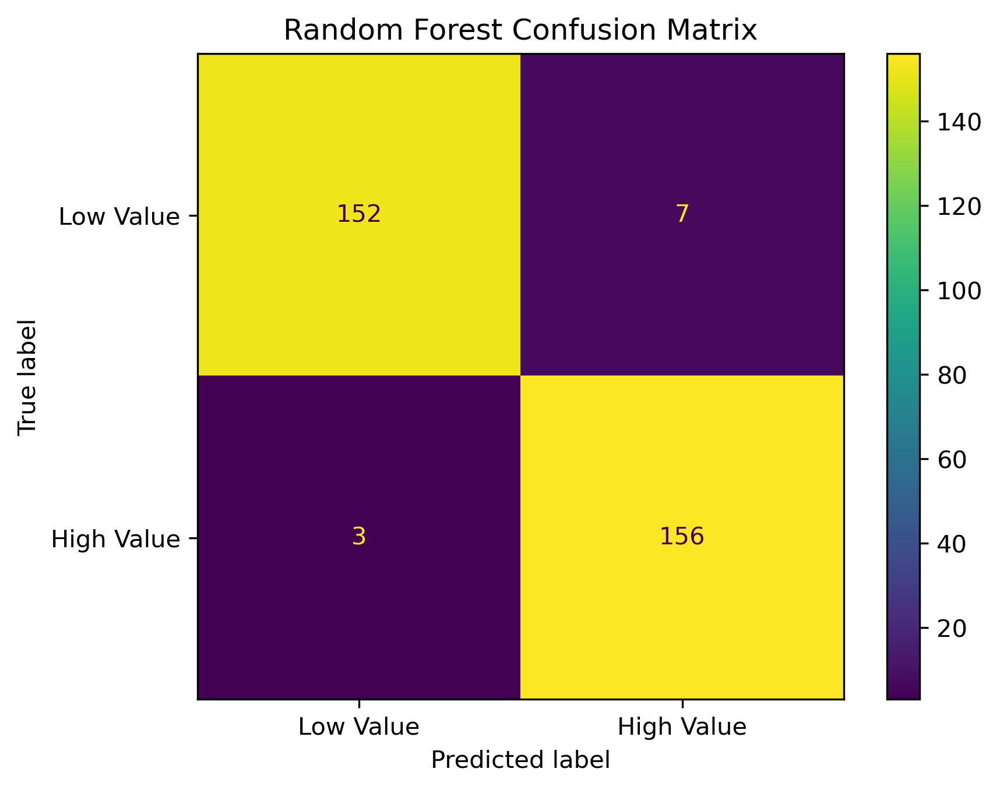
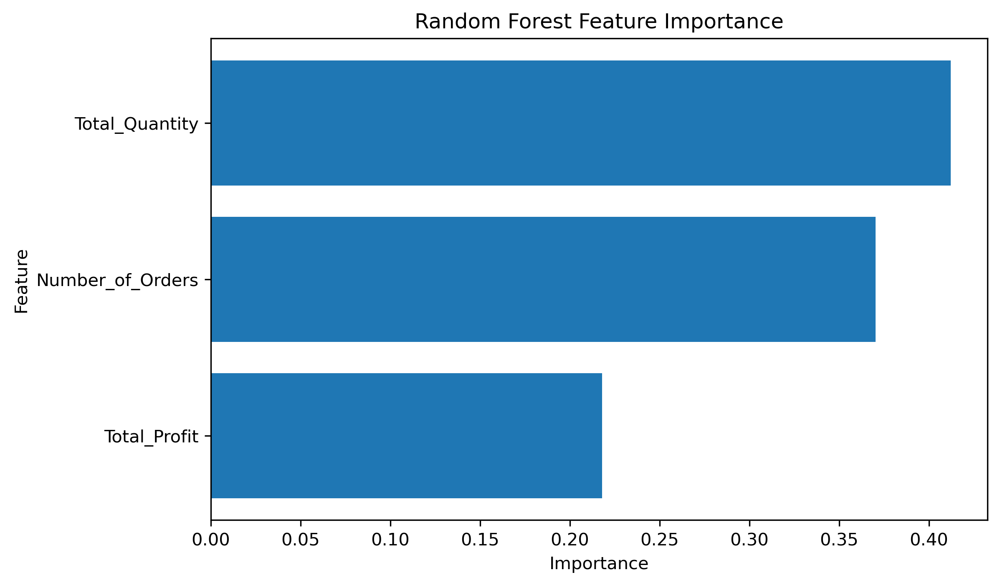

# E-Commerce Data Analysis & Customer Intelligence

An end-to-end data science project analyzing e-commerce transactions to uncover sales trends, customer behavior, profitability patterns, and high-value customer segments.

## Project Overview


This project analyzes 51,290 e-commerce transactions to understand business performance and customer purchasing behavior.

The analysis combines exploratory data analysis, customer-level feature engineering, unsupervised learning, and supervised machine learning to generate actionable business insights.

### Machine Learning Results

#### Customer Segmentation



#### Random Forest Confusion Matrix



#### Feature Importance



## Objectives

- Analyze overall sales, profit, and quantity performance.
- Identify trends across product categories and time.
- Analyze customer purchasing behavior and profitability.
- Segment customers using K-Means clustering.
- Evaluate cluster quality using the Silhouette Score.
- Classify customers into high-value and low-value groups using Random Forest.
- Identify the most important behavioral factors associated with high-value customers.
- Translate analytical results into business recommendations.

## Dataset

The dataset contains:

- 51,290 transactions
- 1,590 unique customers
- 10,292 unique products
- 3 product categories
- 13 regions
- Sales, profit, quantity, discount, shipping cost, and order information

## Technologies Used

- Python
- Pandas
- NumPy
- Matplotlib
- Scikit-learn
- Jupyter Notebook
- Excel

## Analysis Workflow

### 1. Data Preparation

- Loaded and inspected the dataset
- Checked missing values
- Checked duplicate records
- Converted date columns
- Prepared customer-level analytical features

### 2. Exploratory Data Analysis

Analyzed:

- Overall sales and profit
- Sales and profit by category
- Monthly sales and profit trends
- Top-performing products
- Customer sales and profitability
- Order frequency and purchase quantity

### 3. Customer Segmentation

K-Means clustering was applied using:

- Total Sales
- Total Profit
- Total Quantity
- Number of Orders

The best clustering configuration was **K = 2**, with a **Silhouette Score of 0.632**.

The resulting segments were interpreted as:

- High-Value Customers
- Low-Value Customers

### 4. High-Value Customer Classification

A Random Forest classifier was developed to classify customers as high-value or low-value.

The target was defined using the median customer sales value.

To avoid data leakage, `Total_Sales` was excluded from the model features.

Features used:

- Total Profit
- Total Quantity
- Number of Orders

### Model Performance

The Random Forest classifier achieved:

- **Accuracy:** 96.86%
- **Precision:** 95.71%
- **Recall:** 98.11%
- **F1 Score:** 96.89%

To evaluate model stability, stratified 5-fold cross-validation was also
performed.

- **Mean Cross-Validation F1:** 96.67%
- **Standard Deviation:** 0.31%

The low standard deviation indicates consistent performance across
different validation folds.
## Key Business Insights

- Technology generated the highest overall sales and profit among the three product categories.
- Customer purchasing behavior varies significantly across the customer base.
- High-value customers have substantially higher average sales, profit, purchase quantity, and order frequency.
- Purchase quantity and order frequency are important indicators of customer value.
- Customer segmentation can support targeted marketing and retention strategies.

## Business Recommendations

- Provide loyalty rewards and personalized offers to high-value customers.
- Use targeted promotions to increase engagement among low-value customers.
- Focus on increasing purchase frequency and basket size.
- Use customer segmentation to support personalized marketing and retention decisions.

## Project Structure

```text
E-Commerce-Data-Science/
│
├── analysis/
│   └── ecommerce_analysis.ipynb
│
├── Data & Resources/
│   └── ECOM DATA.xlsx
│
├── README.md
├── requirements.txt
├── .gitignore
└── LICENSE
```

## How to Run

### 1. Clone the repository

```bash
git clone https://github.com/shaurya3000/E-Commerce-Data-Science.git
cd E-Commerce-Data-Science
```

### 2. Install required Python packages

```bash
pip install -r requirements.txt
```

### 3. Launch Jupyter Notebook

```bash
jupyter notebook
```

### 4. Open the notebook

Open:

```text
analysis/ecommerce_analysis.ipynb
```

Run the notebook cells from top to bottom.

### 5. Dataset

The analysis uses:

```text
Data & Resources/ECOM DATA.xlsx
```

## License and Attribution

This project is an independent extension of an open-source e-commerce data analysis project. The original project is licensed under GNU GPL v3.0, and the original license is retained in this repository.