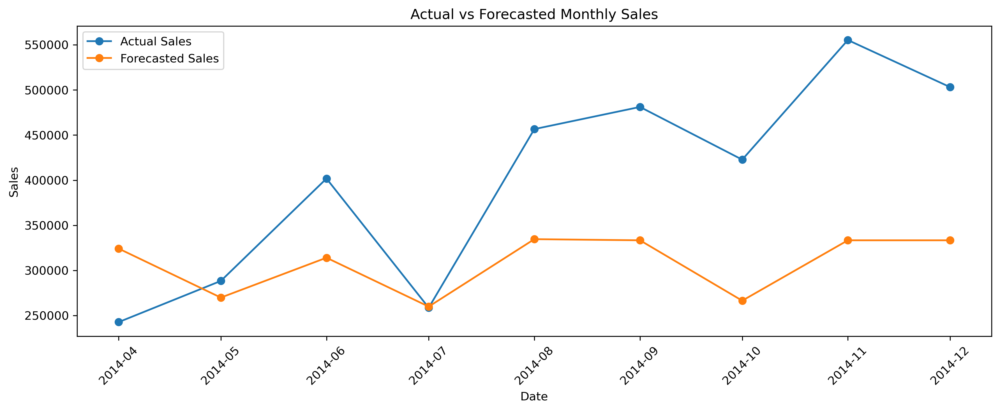

# E-Commerce Data Analysis & Customer Intelligence

An end-to-end data science project analyzing e-commerce transactions to uncover sales trends, customer behavior, profitability patterns, customer segments, future customer value, and sales forecasts.

## Project Overview


This project analyzes 51,290 e-commerce transactions to understand business performance and customer purchasing behavior.

The analysis combines exploratory data analysis, customer-level feature engineering, RFM-based customer segmentation, supervised machine learning, and sales forecasting to generate actionable business insights.

## Objectives

- Analyze overall sales, profit, and quantity performance.
- Identify trends across product categories and time.
- Analyze customer purchasing behavior and profitability.
- Perform RFM-based customer segmentation using K-Means.
- Evaluate clustering quality using the Silhouette Score.
- Predict future customer value using historical purchasing behavior.
- Evaluate future customer value predictions using classification metrics.
- Identify important historical behavioral factors associated with future customer value.
- Forecast monthly sales using historical sales patterns.
- Translate analytical results into business recommendations.

## Dataset

The project uses an e-commerce transaction dataset containing:

- **51,290 transactions**
- **1,590 unique customers**
- **10,292 unique products**
- **3 product categories**
- **13 regions**
- Sales, profit, quantity, discount, shipping cost, and order information.

### Dataset Source

The dataset is included in the repository as `ECOMM DATA.xlsx`.

It was inherited from the original open-source e-commerce analysis project and is used here as the underlying dataset for an independent extension focused on customer analytics and machine learning.

## Technologies Used

- Python
- Pandas
- NumPy
- Matplotlib
- Scikit-learn
- Jupyter Notebook
- Excel
- Power BI

## Analysis Workflow

### 1. Data Preparation

- Loaded and inspected the dataset.
- Checked missing values.
- Checked duplicate records.
- Converted date columns to datetime format.
- Prepared customer-level analytical features.

### 2. Exploratory Data Analysis

Analyzed:

- Overall sales and profit.
- Sales and profit by category.
- Monthly sales and profit trends.
- Top-performing products.
- Customer sales and profitability.
- Order frequency and purchase quantity.

Order-level metrics such as Average Order Value and Average Profit per Order were calculated after aggregating transaction lines by `Order ID`.

### 3. RFM Customer Segmentation

Customer behavior from **2011–2013** was used to create RFM-style features:

- **Recency:** Days since the customer's last purchase.
- **Frequency:** Number of orders placed.
- **Monetary:** Historical customer sales.

The features were standardized before applying K-Means clustering.

K-Means clustering was evaluated for multiple values of K using the Silhouette Score.

The best configuration was:

- **K = 3**
- **Silhouette Score = 0.5366**

The resulting customer segments were:

| Segment | Customers | Behavioral Profile |
|---|---:|---|
| High-Value Loyal | 726 | Recent, frequent purchases and high spending |
| Mid-Value / Developing | 626 | Moderate purchase frequency and spending |
| Inactive / At-Risk | 144 | Low purchase frequency and long time since last purchase |

The segment labels are assigned based on the actual behavioral characteristics of each cluster rather than relying on arbitrary K-Means cluster IDs.


### 4. Future Customer Value Prediction

A Random Forest classifier was developed to predict whether a customer would become high-value in the future based on historical purchasing behavior.

To avoid same-period target leakage, customer behavior from **2011–2013** was used as the model input, while customer sales during **2014** were used to define the future target.

The target was defined using the **median customer sales in 2014 ($1,976.07)**. Customers with sales at or above this value were classified as high-value.

Historical features used:

- Past Sales
- Past Profit
- Past Quantity
- Past Orders
- Recency Days

The analysis included **1,496 customers** who appeared in both the historical and future periods.

### 5. Model Performance

The Random Forest model was evaluated on a held-out 2014 test set.

| Metric | Result |
|---|---:|
| Accuracy | **86.33%** |
| Precision | **86.58%** |
| Recall | **86.00%** |
| F1 Score | **86.29%** |
| ROC-AUC | **0.8669** |

Stratified 5-fold cross-validation was performed on the training data only:

- **Mean Cross-Validation F1:** 85.50%
- **Standard Deviation:** 2.40%

The similar cross-validation and held-out test performance indicates reasonable generalization to unseen customer outcomes.


### 6. Feature Importance

The most influential historical features were:

1. **Past Quantity:** 33.71%
2. **Past Orders:** 23.22%
3. **Past Sales:** 19.83%
4. **Past Profit:** 13.68%
5. **Recency Days:** 9.56%

The results suggest that historical purchase volume and order frequency are important signals for identifying customers who are likely to generate higher sales in the future.


## Sales Forecasting

A Random Forest regression model was developed to forecast monthly e-commerce sales using historical sales patterns.

### Forecasting Approach

- Aggregated transaction-level sales into monthly sales.
- Created lag-based features using previous monthly sales.
- Created a 3-month rolling average.
- Used a chronological 80/20 train-test split.
- Trained a Random Forest Regressor.
- Evaluated predictions using MAE and RMSE.
- Compared the model against a naive forecasting baseline.

### Forecast Performance

| Model | MAE | RMSE |
|---|---:|---:|
| Naive Baseline | 202,538.64 | 230,123.87 |
| **Random Forest** | **111,828.00** | **130,736.57** |

The Random Forest forecasting model reduced:

- **MAE by approximately 44.8%**
- **RMSE by approximately 43.2%**

compared with the naive baseline.



The forecasting component demonstrates how historical sales patterns can support inventory planning, logistics preparation, resource allocation, and promotional planning.

## Business Impact of Prediction Errors

Prediction errors can have different business consequences:

- **False Negative:** A customer who becomes high-value in 2014 is predicted as low-value, potentially causing the business to miss retention or loyalty opportunities.

- **False Positive:** A customer who does not become high-value is predicted as high-value, potentially allocating marketing resources to a lower-value customer.

For customer retention campaigns, false negatives may be particularly important because failing to identify a valuable customer can result in a missed engagement opportunity.

The appropriate prediction threshold would ultimately depend on the relative business cost of false positives and false negatives.

## Key Findings

- Analyzed **51,290 e-commerce transactions** across **1,590 customers** and **10,292 products**.
- Technology generated the highest overall sales and profit among the three product categories.
- Customer-level analysis identified substantial differences in purchasing behavior and profitability.
- RFM-based K-Means clustering identified distinct customer groups based on recency, purchase frequency, and historical spending.
- The resulting segments were **High-Value Loyal**, **Mid-Value / Developing**, and **Inactive / At-Risk**.
- Historical customer behavior from **2011–2013** was used to predict customer sales outcomes in **2014**, avoiding same-period target leakage.
- The future customer value model achieved **86.33% accuracy**, **86.29% F1**, and **0.8669 ROC-AUC** on the held-out 2014 test set.
- Stratified 5-fold cross-validation produced a mean **F1 of 85.50% ± 2.40%**.
- **Past Quantity** and **Past Orders** were the most influential historical features in predicting future customer value.
- Monthly sales forecasting was performed using historical sales, lagged sales, and a 3-month rolling average.
- The Random Forest forecasting model achieved an **MAE of 111,828.00** and **RMSE of 130,736.57**.
- The forecasting model reduced MAE by approximately **44.8%** and RMSE by approximately **43.2%** compared with the naive baseline.

## Business Recommendations

1. **Retain High-Value Loyal customers** through loyalty programs and personalized offers.
2. **Re-engage Inactive / At-Risk customers** through targeted promotions and retention campaigns.
3. **Develop Mid-Value / Developing customers** by encouraging higher purchase frequency and basket size.
4. Prioritize customers predicted to become high-value for retention and personalized marketing initiatives.
5. Consider the relative business cost of false positives and false negatives when selecting the prediction threshold.
6. Use monthly sales forecasts to support **inventory planning, logistics preparation, resource allocation, and promotional planning**.
7. Combine customer segmentation, future-value prediction, and sales forecasting to support more targeted and data-driven business decisions.

## Conclusion

This project demonstrates an end-to-end data science workflow, from data preparation and exploratory analysis to customer segmentation, future customer value prediction, model evaluation, and sales forecasting.

The analysis transforms transactional e-commerce data into actionable insights that can support customer retention, targeted marketing, inventory planning, and business decision making.

The combination of **RFM segmentation, temporally validated customer-value prediction, and sales forecasting** demonstrates the application of both descriptive and predictive analytics to a real-world business problem.

## Modeling Limitations

The future-value model is evaluated among customers who appear in both the historical and future periods. Therefore, it predicts **future customer value among returning customers** rather than predicting whether a customer will return in the first place.

The sales forecasting model uses historical sales patterns, lagged sales, and rolling averages. External factors such as promotions, holidays, pricing changes, and marketing campaigns are not included and could potentially improve forecasting performance.

## Project Structure

```text
E-Commerce-Data-Science/
│
├── analysis/
│   └── ecommerce_analysis.ipynb
│
├── images/
│   ├── rfm_segmentation.png
│   ├── future_value_confusion_matrix.png
│   └── future_value_feature_importance.png
│
├── Data & Resources/
│   └── ECOMM DATA.xlsx
│
├── E-Commerce Data Analysis_page.jpg
├── sales_forecast.png
├── README.md
├── requirements.txt
└── .gitignore